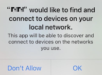

# API Example iOS

*[English](README.md) | 中文*

本项目提供一组 Agora RTC API 示例，帮助你了解各项 API 的使用方式。

## 问题描述

在 iOS 14.0 及以上版本中，应用首次使用 Agora RTC SDK 时，系统会请求访问本地网络设备：



[解决方案](https://docs.agora.io/en/help/integration-issues/local_network_privacy)

## 环境准备

- Xcode 13.0 或更高版本
- iPhone 或 iPad 真机
- 不支持 iOS 模拟器

## 快速开始

以下步骤说明如何安装依赖、配置项目并运行示例。

### 安装依赖

进入当前示例目录，然后安装 CocoaPods 依赖。CocoaPods 的安装方式请参考[官方指南](https://guides.cocoapods.org/using/getting-started.html)。

```bash
cd iOS/APIExample
pod install
```

确认 `APIExample.xcworkspace` 已成功生成。

### 获取 App ID

1. 登录 [Agora Console](https://console.agora.io/) 并创建项目。
2. 在项目详情页复制 App ID。
3. 使用 Xcode 打开 `APIExample.xcworkspace`。
4. 编辑 `APIExample/Common/KeyCenter.swift`，填入 App ID：

   ```swift
   static let AppId: String = "<YOUR_APP_ID>"
   static let Certificate: String? = nil
   ```

如果项目未启用 App Certificate，请保持 `Certificate` 为 `nil`。App Certificate 属于敏感信息，生产环境应在服务端生成 Token，不应将证书写入客户端或提交到 Git。

连接 iPhone 或 iPad 真机后，即可在 Xcode 中构建并运行项目。

### Agora 美颜 2.0 资源

Agora 美颜 2.0 资源包不包含在仓库中。本地构建前，从 Agora 技术支持获取 `AgoraBeautyMaterial.bundle.zip`，并解压到 `iOS/APIExample/APIExample/Resources/`。

解压后的资源目录结构如下：

```text
iOS/APIExample/APIExample/Resources/
└── AgoraBeautyMaterial.bundle/
    ├── beauty_material_functional/
    │   ├── config.json
    │   └── ...
    └── ...
```

解压后的 bundle 已被 Git 忽略。

## 联系我们

- 常见问题请查看 [Agora FAQ](https://docs.agora.io/en/faq)
- 更多示例请查看 [AgoraIO](https://github.com/AgoraIO)
- 复杂场景示例请查看 [AgoraIO Use Cases](https://github.com/AgoraIO-usecase)
- 社区维护项目请查看 [AgoraIO Community](https://github.com/AgoraIO-Community)
- 完整 API 文档请查看 [Agora Documentation](https://docs.agora.io/en/)
- 集成问题可以在 [Stack Overflow](https://stackoverflow.com/questions/tagged/agora.io) 提问
- 示例问题请提交到 [API-Examples Issues](https://github.com/AgoraIO/API-Examples/issues)

## 代码许可

本项目采用 MIT License。
